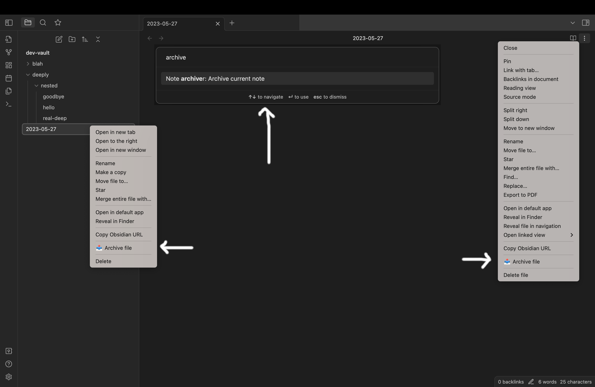
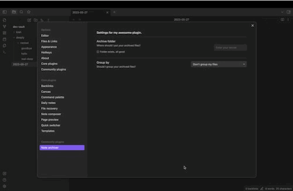
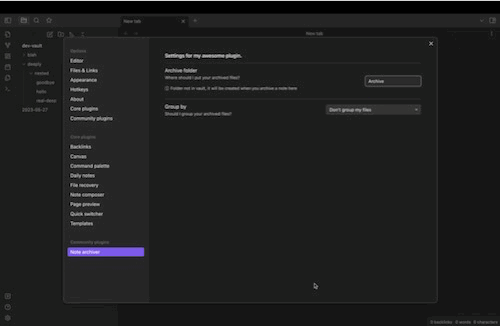

# Obsidian note archiver

This is a simple note archiver utility. Some of my workflows need to move files to different locations so I can keep
my workspace clean. This plugin helps move those documents to an archive folder

- New command in command palette
- Archive button in the editor menu
- Archive button in the file menu

## Simply move your file to a folder

You can set the plugin to move files to a particular folder:

## Group your archived files by year or month

It can also group the archived files based on the year and month the file was archived:

## To be built

- [ ] settings for different parts of the vault (maybe I want to archive my daily notes differently)
- [ ] archive based on date in the file name
- [ ] organize the code better
- [ ] unarchive